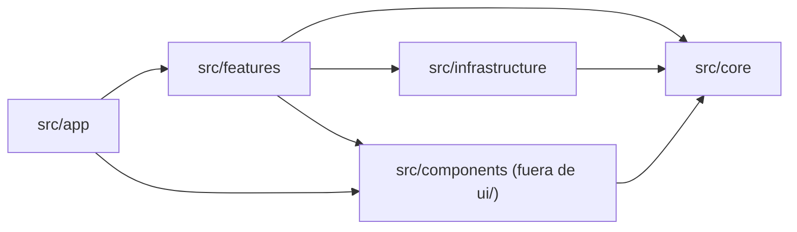

# StatLab

Calculadora estadística web, **solo cliente** (sin backend), en español. Está pensada para un profesor de estadística experto en la materia y poco hábil con tecnología, y para sus estudiantes: se pegan o importan datos, se responde un asistente de pasos en lenguaje natural, y StatLab calcula, explica y grafica.

Todo el cálculo ocurre en el navegador. No hay servidor, no hay base de datos y, salvo que se active explícitamente en una fase futura, no se envía ningún dato a ningún servicio externo.

## Privacidad

**Todos los datos que se ingresan o importan se procesan en el navegador del usuario y nunca salen del dispositivo.** No hay backend que los reciba, no se suben archivos a ningún servidor y no se llama a ninguna API externa con la información cargada. Lo único que persiste es la configuración del análisis en `localStorage` del propio navegador, con un botón para borrarla ("Empezar de cero").

## Para quién es

- Profesores de estadística que quieren generar tablas, gráficas y reportes a partir de datos de clase, sin depender de hojas de cálculo ni de software especializado.
- Estudiantes que necesitan resolver ejercicios de estadística descriptiva y entender, con explicaciones en español y sin jerga, qué significa cada resultado y para qué sirve.

## Características

- **Entrada de datos por tres vías equivalentes:** texto pegado (con detección automática de coma, punto y coma, tabulador o salto de línea), archivo CSV o archivo Excel (`.xlsx`/`.xls`, con selección de hoja).
- **Detección automática del tipo de variable** (cualitativa nominal, cualitativa ordinal, cuantitativa discreta, cuantitativa continua), siempre editable por el usuario.
- **Asistente de pasos (wizard)** en lenguaje natural: qué datos analizar, qué tipo de variables son, qué cálculos se necesitan, qué gráficas se necesitan, y resultados.
- **Cálculos de estadística descriptiva:**
  - Distribución de frecuencias (absoluta, relativa o porcentual, acumuladas) por valores únicos o agrupada en intervalos (reglas de Sturges, raíz, Rice, Scott, Freedman–Diaconis o manual).
  - Mínimo, máximo y rango.
  - Medidas de tendencia central: moda (amodal, unimodal, multimodal), mediana (datos crudos y agrupados), media aritmética, ponderada, geométrica y armónica.
  - Medidas de posición: cuartiles, deciles y percentiles (método inclusivo R-7 o exclusivo R-6).
  - Medidas de variabilidad: varianza muestral y poblacional, desviación estándar, coeficiente de variación, rango intercuartílico y valores atípicos (criterio de Tukey).
  - Tabla de contingencia entre dos variables, con porcentajes por fila, columna o total, y resaltado interactivo del máximo y el mínimo de cada fila y columna.
- **Gráficas:** circular, barras, histograma, polígono de frecuencia, ojiva (acumulada) y barras agrupadas/apiladas para contingencia, todas con la misma paleta de colores por variable y con tabla accesible equivalente.
- **Explicación obligatoria en cada métrica**, tabla y gráfica: un texto corto de "qué significa" y "para qué sirve", visible en pantalla e incluible en el PDF.
- **Exportación:** datos y tablas a CSV y XLSX, gráficas a imagen (PNG/SVG), y reporte completo o parcial a PDF con portada y secciones seleccionables.
- **Fase 2 (prevista, no implementada):** puerto `AiReportProvider` para un reporte narrado con IA (Gemini). Ver `docs/06-preguntas-para-el-profesor.md` para las preguntas pendientes sobre alcance.

## Stack

- [Next.js](https://nextjs.org) 16.3.5 (App Router, `output: "export"`) + [React](https://react.dev) 19.2.8 + TypeScript estricto
- [Tailwind CSS](https://tailwindcss.com) v4 + [shadcn/ui](https://ui.shadcn.com) (estilo `new-york`, base `neutral`)
- [Zustand](https://zustand-demo.pmnd.rs) 5 (estado) y [Zod](https://zod.dev) 4 (validación)
- [Recharts](https://recharts.org) 3.8 (gráficos)
- [xlsx (SheetJS)](https://sheetjs.com) y [PapaParse](https://www.papaparse.com) 5.7 (import/export de datos)
- [jsPDF](https://github.com/parallax/jsPDF) 4 + [html-to-image](https://github.com/bubkoo/html-to-image) 1.11 (export de reportes e imágenes)
- [Vitest](https://vitest.dev) 5 + Testing Library (tests)

## Requisitos

- Node.js **22** (ver `.nvmrc`)
- pnpm **11** (`packageManager` fijado en `package.json`)

## Comandos

```bash
pnpm dev              # servidor de desarrollo
pnpm build            # build de producción (export estático a out/)
pnpm start            # sirve el build (uso local, no aplica al export estático)
pnpm lint             # ESLint
pnpm lint:fix         # ESLint con --fix
pnpm format           # Prettier --write
pnpm format:check     # Prettier --check
pnpm typecheck        # tsc --noEmit
pnpm test             # Vitest (una pasada)
pnpm test:watch       # Vitest en modo watch
pnpm test:coverage    # Vitest con cobertura
pnpm check            # lint + format:check + typecheck + test
```

Antes de publicar un cambio, `pnpm check` y `pnpm build` deben terminar sin errores.

## Estructura de carpetas y regla de dependencias

```
src/
  core/            # lógica pura (estadística, modelos de datos). Sin UI ni framework.
    statistics/    # tablas de frecuencia, tendencia central, posición, variabilidad, contingencia
    data/          # Dataset/Column/Variable, parseo, inferencia de tipo, paleta
  infrastructure/  # adaptadores: import (CSV/Excel), export (PDF/Excel/imagen),
    import/        # storage (localStorage) e IA (interfaz para Fase 2 con Gemini).
    export/
    storage/
    ai/
  features/        # casos de uso de la app (wizard, análisis, export), UI de feature.
    wizard/        # store, esquemas y pasos del asistente (en curso)
    analysis/      # ejecución de análisis y presentación de resultados
    export/        # selección y armado de reportes exportables
  components/      # componentes de presentación reutilizables.
    ui/            # generado por shadcn/ui (exento de la regla de fronteras).
    charts/        # envoltorios Recharts + paleta determinista
    tables/        # tablas de datos y resultados
    layout/        # shell de la app, stepper, tema
    shared/        # tarjetas de métrica, ayudas, formateo de presentación
  app/             # rutas de Next.js (App Router).
  lib/             # utilidades transversales (p. ej. `cn`).
  test/            # setup de Vitest.
```

Regla de dependencias entre capas, forzada automáticamente por `eslint.config.mjs`:



- `src/core` no puede importar de `infrastructure`, `features`, `components`, `app`, `react` ni `next`. Es TypeScript puro.
- `src/infrastructure` solo puede importar de `src/core` y librerías externas.
- `src/features` puede importar de `core`, `infrastructure` y `components` (no de `app`).
- `src/components` (fuera de `ui/`) solo puede importar de `core`, `lib` y otros `components`.
- `src/app` solo puede importar de `features` y `components` (no directamente de `core` ni `infrastructure`).
- `src/components/ui` (generado por shadcn/ui) está exento de esta regla.

Un PR que rompa esta dirección de dependencias falla el lint en CI. Ver el detalle y la justificación de la regla en `docs/02-arquitectura.md`.

## Convenciones

- **Tests colocados junto al código:** `frequency-table.ts` + `frequency-table.test.ts` en la misma carpeta, nunca en un directorio `__tests__` aparte.
- **Alias `@/` obligatorio entre capas:** todo import que cruce carpetas de `src/` usa `@/core/...`, `@/features/...`, etc. Los imports relativos que crucen capas no son detectables por la regla de ESLint, así que la convención es la única defensa real.
- **Explicación obligatoria en cada métrica:** ninguna métrica, tabla o gráfica se muestra sin su microtexto "qué significa / para qué sirve" (ver `docs/01-requisitos.md` §5).
- **El redondeo ocurre solo en la capa de presentación** (`src/lib/format` y equivalentes en `components/shared`). `src/core` siempre devuelve el valor completo en `number`, sin redondear.
- **Precisión numérica:** suma compensada de Neumaier para medias y algoritmo de Welford para varianzas, para evitar cancelación catastrófica.

## Documentación

- [`docs/01-requisitos.md`](docs/01-requisitos.md) — requisitos funcionales y no funcionales, matriz de aplicabilidad por tipo de variable.
- [`docs/02-arquitectura.md`](docs/02-arquitectura.md) — arquitectura por capas, convenciones, contrato de tipos.
- [`docs/03-adr/`](docs/03-adr) — decisiones de arquitectura (ADRs), incluida la definición exacta de cada fórmula estadística.
- [`docs/04-plan-implementacion.md`](docs/04-plan-implementacion.md) — plan de implementación por paquetes de trabajo y su estado actual.
- [`docs/06-preguntas-para-el-profesor.md`](docs/06-preguntas-para-el-profesor.md) — preguntas abiertas para el profesor, en lenguaje llano, con las decisiones tomadas por defecto.
- [`docs/07-despliegue.md`](docs/07-despliegue.md) — pasos para desplegar en Vercel.

## Despliegue (Vercel)

- **Framework:** Next.js.
- **Build:** `pnpm build` (`next build` con `output: "export"`) → directorio de salida `out/`.
- **Cabeceras de seguridad** (Content-Security-Policy, X-Frame-Options, Referrer-Policy, etc.) definidas en `vercel.json`.
- **Dominio:** `estadistica.juandgaitan.com`, apuntado mediante un registro DNS **CNAME** hacia `cname.vercel-dns.com`.

Ver la guía paso a paso, con verificación de cabeceras y checklist previo a publicar, en [`docs/07-despliegue.md`](docs/07-despliegue.md).
