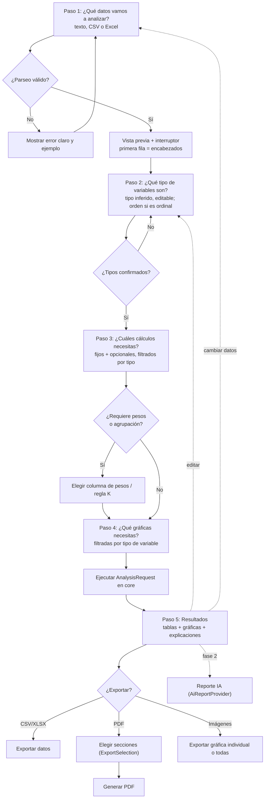

# StatLab — Arquitectura

Arquitectura hexagonal ligera por capas sobre Next.js App Router. El corazón es un **dominio estadístico puro en TypeScript**, sin React ni dependencias externas, alrededor del cual orbitan adaptadores de entrada/salida y una capa de casos de uso (wizard).

---

## 1. Estructura de carpetas

```
src/
  core/
    statistics/
      frequency/           distribución de frecuencias (simple y agrupada)
      grouping/            intervalos: K, longitud l, límites, marcas de clase
      central-tendency/    media aritmética, ponderada, geométrica, armónica, mediana, moda
      position/            cuartiles, deciles, percentiles (R-7 y R-6)
      variability/         rango, varianza, desviación, CV, RIC, atípicos
      contingency/         tabla de dos variables con marginales
      numeric/             suma compensada, Welford, comparadores, utilidades
      explanations/        catálogo de microtextos "qué significa / para qué sirve"
      types.ts             tipos de resultado enriquecidos
    data/
      dataset.ts           Dataset, Column, Cell
      variable.ts          Variable, VariableKind
      infer-kind.ts        inferencia de tipo de variable
      parse-text.ts        parseo de texto separado por comas/saltos/;/tab
      parse-number.ts      número con coma o punto decimal, miles
      missing.ts           detección y política de valores faltantes
      palette.ts           mapa determinista variable+categoria -> color
  infrastructure/
    import/   csv-importer.ts (PapaParse) · xlsx-importer.ts (SheetJS)
    export/   csv-exporter.ts · xlsx-exporter.ts · pdf-exporter.ts (jsPDF)
              image-exporter.ts (html-to-image) · filename.ts
    storage/  local-storage.ts (persistencia del wizard)
    ai/       ai-report-provider.ts  <- PUERTO, sin implementación (fase 2)
  features/
    wizard/         máquina de pasos, guardas, navegación
    data-input/     caso de uso paso 1
    variable-setup/ caso de uso paso 2
    calculations/   caso de uso paso 3 (selección + ejecución)
    charts/         caso de uso paso 4 (ChartSpec)
    results/        composición del AnalysisResult para la vista
    export/         caso de uso de exportación (ExportSelection)
    store/          slices de Zustand
    schemas/        esquemas zod por paso
  components/
    ui/      shadcn/ui (generado, no se edita a mano salvo necesidad)
    charts/  envoltorios Recharts: PieChart, BarChart, FrequencyPolygon, Ogive, ContingencyChart
    tables/  FrequencyTable, PositionTable, VariabilityTable, ContingencyTable, DataPreviewTable
    common/  MetricCard, ExplanationHint, StepShell, EmptyState
  app/
    layout.tsx · page.tsx · analisis/page.tsx · globals.css
  lib/
    format/  redondeo y formato es-419 (SOLO presentación)
    i18n/    textos de la UI
```

## 2. Regla de dependencia

```
app  ->  features  ->  core
             |
       infrastructure  ->  core
```

- `core/statistics` no importa **nada**: ni React, ni Zustand, ni zod, ni `core/data`… salvo `core/statistics/*` interno. Recibe arrays de números o de cadenas ya limpios.
- `core/data` puede importar `core/statistics/numeric` pero nada fuera de `core`.
- `infrastructure` importa `core` y librerías externas (PapaParse, SheetJS, jsPDF). **No** importa `features`, `components` ni `app`.
- `features` importa `core` e `infrastructure` (a través de sus interfaces) y define los casos de uso. No importa `app`.
- `components` importa `core` (tipos y explicaciones), `features` (hooks de estado) y `lib/format`. No importa `infrastructure` directamente: la exportación se dispara desde un caso de uso de `features/export`.
- `app` solo compone: importa `features` y `components`.
- Ninguna capa importa hacia arriba. Prohibidos los ciclos.

### Cómo se hace cumplir (ESLint)

`eslint.config.mjs`, con `eslint-plugin-import` y `import/no-restricted-paths` (alternativa equivalente: `eslint-plugin-boundaries`):

```js
'import/no-restricted-paths': ['error', {
  zones: [
    { target: './src/core', from: './src/infrastructure' },
    { target: './src/core', from: './src/features' },
    { target: './src/core', from: './src/components' },
    { target: './src/core', from: './src/app' },
    { target: './src/core', from: './src/lib' },
    { target: './src/infrastructure', from: './src/features' },
    { target: './src/infrastructure', from: './src/app' },
    { target: './src/features', from: './src/app', except: ['./src/app'] },
    { target: './src/components', from: './src/infrastructure' },
  ],
}],
'import/no-cycle': ['error', { maxDepth: Infinity }],
'no-restricted-imports': ['error', {
  patterns: [
    { group: ['react', 'react-dom', 'next/*', 'zustand', 'zod', 'recharts', 'xlsx', 'papaparse', 'jspdf', 'html-to-image'],
      message: 'src/core debe permanecer puro.' },
  ],
}],
```

La última regla se aplica en un bloque `files: ['src/core/**']`. En CI, `pnpm lint` falla el build si alguien cruza una frontera.

## 3. Convenciones

- **Archivos y carpetas**: `kebab-case` (`frequency-table.ts`, `infer-kind.ts`). Los componentes React se exportan en `PascalCase` desde archivos `kebab-case` (`frequency-table.tsx` exporta `FrequencyTable`).
- **Tipos e interfaces**: `PascalCase`, sin prefijo `I`. Uniones de literales en lugar de `enum`.
- **Funciones de dominio**: verbos explícitos, puras, sin efectos (`computeFrequencyTable`, `computePercentile`, `buildIntervals`).
- **Barrel files** solo por subcarpeta de `core` (`index.ts`), nunca globales, para no romper el tree-shaking.
- **Tests colocados junto al código**: `frequency-table.ts` + `frequency-table.test.ts` en la misma carpeta. Vitest con `include: ['src/**/*.test.ts?(x)']`. Los datos de referencia de ejemplos del profesor viven en `src/core/statistics/__fixtures__/`.
- **Nada de redondeo en `core`**: el dominio devuelve `number` completo; `lib/format` redondea al mostrar.
- **`'use client'`** solo en `components/**` y en los hooks de `features/**` que tocan estado; los casos de uso puros quedan agnósticos.

## 4. Precisión numérica

- Sumatorias con compensación de Neumaier (`core/statistics/numeric/sum.ts`).
- Media y varianza con el algoritmo de **Welford** en una pasada; varianza muestral con divisor n−1.
- Media geométrica en el espacio logarítmico: `exp(mean(ln xi))`, evitando desbordamiento del producto.
- Ordenación numérica explícita (`(a, b) => a - b`), nunca el comparador por defecto.
- Comparación de igualdad de flotantes con tolerancia relativa (`epsEq`) al detectar modas y empates en valores continuos.
- Tests con tolerancia `toBeCloseTo(…, 10)` contra valores de referencia calculados con R/Excel.

## 5. Paleta consistente por variable

`core/data/palette.ts` expone una función pura y determinista:

```ts
export function buildPalette(variableId: string, categories: readonly string[]): PaletteMap;
// PaletteMap = ReadonlyMap<string, string>  (categoría -> color hex)
```

- La paleta base es una secuencia fija de 12 colores accesibles (validada para deuteranopía) definida como tokens CSS y también como constantes para la exportación a imagen y PDF.
- El índice de color se asigna por el **orden canónico de categorías de la variable** (orden declarado para ordinal; orden de aparición o alfabético para nominal; orden numérico para intervalos). Así el mismo dato tiene el mismo color en pie, barras, polígono, ojiva y contingencia.
- Si hay más categorías que colores base, se generan variaciones de luminosidad deterministas (`hash(variableId + categoria)` solo como desempate estable, nunca aleatorio).
- La paleta se calcula una vez por variable y se guarda en el store; todos los `ChartSpec` la reciben por referencia.

## 6. Flujo del wizard



Cambiar datos invalida pasos 2–5; cambiar tipos invalida 3–5. El store marca cada paso como `pendiente | completo | invalidado`.

## 7. Contrato de tipos principal

```ts
// ---------- core/data ----------
export type VariableKind = "nominal" | "ordinal" | "discreta" | "continua";

export type CellValue = string | number | null; // null = faltante

export interface Variable {
  readonly id: string; // estable, base de la paleta
  readonly name: string; // nombre mostrado (encabezado)
  readonly kind: VariableKind;
  readonly kindInferred: VariableKind; // lo que dedujo el sistema
  readonly kindConfirmedByUser: boolean;
  readonly categoryOrder?: readonly string[]; // obligatorio si kind === 'ordinal'
  readonly unit?: string;
  readonly decimals?: number; // precisión detectada en los datos
}

export interface Column {
  readonly variable: Variable;
  readonly values: readonly CellValue[];
  readonly missingCount: number;
}

export interface Dataset {
  readonly id: string;
  readonly source: "texto" | "csv" | "xlsx";
  readonly sourceName?: string; // nombre de archivo u hoja
  readonly columns: readonly Column[];
  readonly rowCount: number;
  readonly createdAt: string; // ISO
  readonly warnings: readonly DatasetWarning[];
}

export interface DatasetWarning {
  readonly code: "faltantes" | "tipo-mixto" | "muchas-categorias" | "tamano" | "decimal-ambiguo";
  readonly variableId?: string;
  readonly message: string; // en español, para el usuario
}

export type MissingPolicy = "excluir-por-variable" | "excluir-fila-completa";

// ---------- core/statistics: explicación adjunta ----------
export interface Explanation {
  readonly what: string; // "Qué significa"
  readonly why: string; // "Para qué sirve"
  readonly formula?: string; // notación legible, para el modo docente
}

export interface Metric {
  readonly key: string; // 'media-aritmetica', 'cv', ...
  readonly label: string; // "Media aritmética"
  readonly value: number | null; // null = no calculable
  readonly unavailableReason?: string; // p.ej. "hay valores <= 0"
  readonly explanation: Explanation;
}

// ---------- petición de análisis ----------
export interface GroupingOptions {
  readonly enabled: boolean;
  readonly rule: "sturges" | "raiz" | "rice" | "scott" | "freedman-diaconis" | "manual";
  readonly manualK?: number;
  readonly closure: "cerrado-abierto" | "abierto-cerrado";
}

export interface FrequencyOptions {
  readonly relativeMode: "proporcion" | "porcentaje"; // nunca ambas (RF-15)
  readonly showCumulative: boolean;
  readonly showClassMark: boolean;
}

export interface CentralTendencyOptions {
  readonly arithmetic: boolean;
  readonly weighted: boolean;
  readonly weightsSource?:
    | { kind: "columna"; variableId: string }
    | { kind: "manual"; weights: readonly number[] }
    | { kind: "frecuencias" };
  readonly geometric: boolean;
  readonly harmonic: boolean;
  readonly median: boolean;
  readonly mode: boolean;
}

export interface PositionOptions {
  readonly quartiles: boolean;
  readonly quartileMethod: "inclusivo" | "exclusivo"; // R-7 / R-6
  readonly includeQ2: boolean;
  readonly deciles: boolean;
  readonly percentiles: readonly number[] | "todos";
}

export interface VariabilityOptions {
  readonly range: boolean;
  readonly sampleVariance: boolean;
  readonly populationVariance: boolean;
  readonly standardDeviation: boolean;
  readonly coefficientOfVariation: boolean;
  readonly iqr: boolean;
  readonly outliers: boolean;
}

export interface VariableAnalysisRequest {
  readonly variableId: string;
  readonly grouping: GroupingOptions;
  readonly frequency: FrequencyOptions;
  readonly central: CentralTendencyOptions;
  readonly position: PositionOptions;
  readonly variability: VariabilityOptions;
}

export interface ContingencyRequest {
  readonly rowVariableId: string;
  readonly columnVariableId: string;
  readonly percentages: "ninguno" | "fila" | "columna" | "total";
}

export interface AnalysisRequest {
  readonly datasetId: string;
  readonly missingPolicy: MissingPolicy;
  readonly variables: readonly VariableAnalysisRequest[];
  readonly contingencies: readonly ContingencyRequest[];
  readonly charts: readonly ChartSpec[];
}

// ---------- resultados ----------
export interface FrequencyRow {
  readonly label: string; // "3" o "[1.5, 2.0)"
  readonly lowerBound?: number;
  readonly upperBound?: number;
  readonly classMark?: number; // xi
  readonly absolute: number; // fi
  readonly relative: number; // hi (0..1); el % se deriva al formatear
  readonly cumulativeAbsolute: number; // Fi
  readonly cumulativeRelative: number; // Hi
}

export interface FrequencyTableResult {
  readonly variableId: string;
  readonly grouped: boolean;
  readonly rule?: GroupingOptions["rule"];
  readonly k?: number;
  readonly intervalLength?: number; // l
  readonly rows: readonly FrequencyRow[];
  readonly n: number; // n efectivo tras faltantes
  readonly excluded: number;
  readonly explanation: Explanation;
}

export interface ModeResult {
  readonly kind: "amodal" | "unimodal" | "multimodal";
  readonly values: readonly { value: string | number; count: number }[];
  readonly explanation: Explanation;
}

export interface CentralTendencyResult {
  readonly variableId: string;
  readonly metrics: readonly Metric[]; // media aritmética, ponderada, geométrica, armónica, mediana
  readonly mode: ModeResult;
  readonly groupedMedian?: Metric; // versión interpolada si hay agrupación
  readonly groupedMode?: Metric;
}

export interface PositionResult {
  readonly variableId: string;
  readonly method: "inclusivo" | "exclusivo";
  readonly quartiles: readonly Metric[];
  readonly deciles: readonly Metric[];
  readonly percentiles: readonly Metric[];
}

export interface VariabilityResult {
  readonly variableId: string;
  readonly metrics: readonly Metric[];
  readonly outliers: readonly number[];
  readonly fences: { readonly lower: number; readonly upper: number } | null;
}

export interface ContingencyCell {
  readonly absolute: number;
  readonly rowPercent: number;
  readonly columnPercent: number;
  readonly totalPercent: number;
}

export interface ContingencyResult {
  readonly rowVariableId: string;
  readonly columnVariableId: string;
  readonly rowLabels: readonly string[];
  readonly columnLabels: readonly string[];
  readonly cells: readonly (readonly ContingencyCell[])[];
  readonly rowTotals: readonly number[];
  readonly columnTotals: readonly number[];
  readonly grandTotal: number;
  readonly rowExtremes: readonly { readonly maxIndex: number; readonly minIndex: number }[];
  readonly columnExtremes: readonly { readonly maxIndex: number; readonly minIndex: number }[];
  readonly explanation: Explanation;
}

export interface VariableAnalysisResult {
  readonly variableId: string;
  readonly summary: readonly Metric[]; // n, mínimo, máximo
  readonly frequency?: FrequencyTableResult;
  readonly central?: CentralTendencyResult;
  readonly position?: PositionResult;
  readonly variability?: VariabilityResult;
  readonly notes: readonly string[]; // advertencias en español
}

export interface AnalysisResult {
  readonly requestId: string;
  readonly datasetId: string;
  readonly computedAt: string;
  readonly variables: readonly VariableAnalysisResult[];
  readonly contingencies: readonly ContingencyResult[];
  readonly charts: readonly ChartSpec[];
}

// ---------- gráficas ----------
export type ChartType = "pie" | "barras" | "histograma" | "poligono" | "ojiva" | "contingencia";

export interface ChartSpec {
  readonly id: string;
  readonly type: ChartType;
  readonly title: string;
  readonly variableId: string;
  readonly secondVariableId?: string; // solo contingencia
  readonly source: "frecuencia" | "frecuencia-acumulada" | "contingencia";
  readonly labels: {
    readonly showValue: boolean;
    readonly showPercent: boolean;
    readonly showCategory: boolean;
  };
  readonly paletteKey: string; // variableId; resuelve a PaletteMap
  readonly caption: string; // línea explicativa
}

// ---------- exportación ----------
export interface ExportSelection {
  readonly format: "pdf" | "csv" | "xlsx" | "png" | "svg";
  readonly title?: string;
  readonly includeRawData: boolean;
  readonly includeExplanations: boolean;
  readonly variableIds: readonly string[];
  readonly sections: readonly (
    | "resumen"
    | "frecuencias"
    | "tendencia-central"
    | "posicion"
    | "variabilidad"
    | "contingencia"
    | "graficas"
  )[];
  readonly chartIds: readonly string[];
}

// ---------- puerto de IA (fase 2, sin implementación) ----------
export interface AiReportRequest {
  readonly result: AnalysisResult;
  readonly audience: "docente" | "estudiante";
  readonly language: "es";
}
export interface AiReportResult {
  readonly markdown: string;
  readonly model: string;
  readonly generatedAt: string;
}
export interface AiReportProvider {
  readonly id: string; // 'gemini'
  isAvailable(): boolean;
  generate(request: AiReportRequest, signal?: AbortSignal): Promise<AiReportResult>;
}
```

## 8. Estado (Zustand) y validación (zod)

- Un store con slices: `datasetSlice`, `variablesSlice`, `calculationsSlice`, `chartsSlice`, `resultSlice`, `uiSlice`. Middleware `persist` (localStorage) sobre los slices de configuración.
- Los selectores derivan datos; el `AnalysisResult` se calcula en un caso de uso puro (`features/calculations/run-analysis.ts`) que llama a `core` y guarda el resultado en el store. `core` nunca conoce el store.
- zod valida en la frontera: `schemas/data-input.schema.ts`, `variable-setup.schema.ts`, `calculations.schema.ts`, `charts.schema.ts`, y también los objetos rehidratados de localStorage (protección contra estado corrupto). Los mensajes de zod están en español.

## 9. Next.js y despliegue

- App Router con una única ruta funcional (`/` landing + `/analisis` wizard). Todo client-side; `output: 'export'` es viable porque no hay rutas dinámicas de servidor, ni `Image` optimizado en servidor (se usa `unoptimized`), ni route handlers.
- `dynamic: 'force-static'`, sin `revalidate`. Vercel sirve el `out/` estático.
- Importación diferida de las librerías pesadas en los adaptadores de `infrastructure`:
  `const XLSX = await import('xlsx')` dentro de la función del exportador/importador.

## 10. Tests

| Capa                | Tipo                                                  | Herramienta                          |
| ------------------- | ----------------------------------------------------- | ------------------------------------ |
| `core/**`           | unitarios exhaustivos, casos de referencia            | Vitest (entorno node)                |
| `core/data`         | parseo, inferencia, faltantes, paleta determinista    | Vitest                               |
| `infrastructure/**` | adaptadores con archivos de muestra en `__fixtures__` | Vitest (+ jsdom donde haga falta)    |
| `features/**`       | casos de uso y transiciones del wizard                | Vitest sobre el store sin renderizar |
| `components/**`     | render y accesibilidad de tablas y gráficas           | Vitest + Testing Library (jsdom)     |
| Flujo completo      | humo: pegar datos → resultados → exportar             | Playwright (opcional, WP-07)         |
