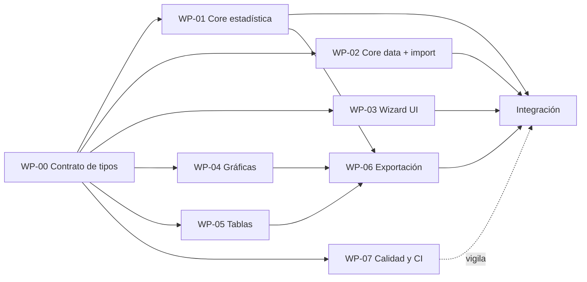

# StatLab — Plan de implementación

Desglose en paquetes de trabajo (WP) pensados para repartirse entre agentes en paralelo. La clave de la paralelización es que **el contrato de tipos de `02-arquitectura.md` §7 se escribe primero y se congela**: cada WP programa contra esos tipos sin esperar a los demás.

## Estado

Estado real según lo que existe hoy en `src/` (verificado por lectura directa del árbol de archivos, no aspiracional):

| WP    | Alcance                       | Estado       | Evidencia                                                                                                                                                                                                                                         |
| ----- | ----------------------------- | ------------ | ------------------------------------------------------------------------------------------------------------------------------------------------------------------------------------------------------------------------------------------------- |
| WP-00 | Contrato de tipos             | Implementado | `src/core/data/types.ts`, `src/core/statistics/types.ts`, `src/core/statistics/explanations/catalog.ts`, `src/infrastructure/ai/ai-report-provider.ts`                                                                                            |
| WP-01 | Núcleo estadístico            | Implementado | `src/core/statistics/{frequency,grouping,central-tendency,position,variability,contingency,numeric}/**` y `run-variable-analysis.ts` con tests junto al código                                                                                    |
| WP-02 | Modelo de datos e importación | Implementado | `src/core/data/**` (parseo, inferencia, límites, vectores) y `src/infrastructure/import/{csv,text,xlsx}-importer.ts`                                                                                                                              |
| WP-03 | Wizard y UI de pasos          | En curso     | `src/features/wizard/` solo tiene `README.md`; el store, los esquemas y los cinco pasos aún no existen                                                                                                                                            |
| WP-04 | Gráficas                      | Implementado | `src/components/charts/**` (pie, barras, histograma, polígono, ojiva, contingencia, paleta, registry)                                                                                                                                             |
| WP-05 | Tablas de resultados          | Implementado | `src/components/tables/data-table.tsx`, `src/components/shared/{metric-card,format}.ts`, tablas de `src/features/analysis/components/**`                                                                                                          |
| WP-06 | Exportación                   | Implementado | `src/infrastructure/export/{csv,xlsx}-exporter.ts`, `export/image/image-exporter.ts`, `export/pdf/pdf-builder.ts`, `src/features/export/**`                                                                                                       |
| WP-07 | Calidad, CI y accesibilidad   | Pendiente    | No hay workflow de CI (`.github/workflows`), ni configuración de umbrales de cobertura por directorio, ni auditoría de accesibilidad automatizada; falta revisión final de fórmulas con el profesor (ver `docs/06-preguntas-para-el-profesor.md`) |

Nota: WP-03 aparece en el plan original como un único paquete; en la práctica se está trabajando como **WP-03b (wizard)**, con el resto de capas (core, gráficas, tablas, exportación) ya cerradas y esperando la integración final del asistente de pasos.

## 0. WP-00 — Contrato de tipos (bloqueante, media jornada)

Antes de abrir cualquier WP, un solo agente crea:

- `src/core/data/types.ts` y `src/core/statistics/types.ts` con los tipos de §7 de la arquitectura.
- `src/core/statistics/explanations/catalog.ts` con los microtextos de 01-requisitos §5.
- `src/infrastructure/ai/ai-report-provider.ts` (puerto + implementación nula).
- Configuración de ESLint con la regla de dependencia y de Vitest.

**Criterio de aceptación:** `tsc --noEmit` y `eslint` pasan sobre un repo con los tipos y ningún cálculo. A partir de aquí, WP-01..WP-06 avanzan en paralelo.

---

## WP-01 — Núcleo estadístico (`src/core/statistics/**`)

**Depende de:** WP-00. **No depende de nada más.** Es el WP más crítico y el más paralelizable internamente (un submódulo por agente si hace falta).

**Alcance:** `numeric/` (suma de Neumaier, Welford, `quantile`, comparadores con tolerancia), `frequency/`, `grouping/`, `central-tendency/`, `position/`, `variability/`, `contingency/`, y el ensamblado `runVariableAnalysis(values, request) -> VariableAnalysisResult`. Implementa literalmente ADR-003.

**Criterios de aceptación**

- Ninguna importación fuera de `src/core/statistics`; ESLint lo verifica.
- Todas las funciones puras, sin `Date`, sin `Math.random`, sin `console`.
- Cada resultado incluye su `Explanation`.
- Los casos degenerados de ADR-003 §8 están cubiertos y devuelven `null` + motivo, nunca `NaN` filtrado a la UI.
- Cobertura >= 95 % líneas y ramas en este directorio.

**Tests mínimos**

- Sturges, raíz, Rice, Scott y FD con n = 1, 2, 10, 100, 1000; K acotado a [2, 50]; `K·l >= R` siempre.
- Tabla de frecuencias: suma de `fi` = n; `Hi` final = 1 (con tolerancia); clases cubren mínimo y máximo; el máximo cae en la última clase (cierre).
- Media: contra referencia manual; caso de cancelación (`[1e9+1, 1e9+2, 1e9+3]`) con precisión de 10 decimales.
- Ponderada: pesos válidos, peso negativo, suma de pesos 0, pesos = frecuencias.
- Geométrica: valores positivos; con 0; con negativo; verificación `H < G < media` en un conjunto positivo no constante.
- Armónica: caso de velocidades clásico; valor 0.
- Mediana: n par e impar; coincidencia exacta con `quantile(p=0.5, R-7)`; versión agrupada contra un ejercicio de libro; ordinal con n par.
- Moda: amodal, unimodal, bimodal, trimodal, todos los valores iguales, moda interpolada.
- Cuantiles: comparación tabulada contra valores de R `quantile(type=7)` y `type=6`; extremos p=0 y p=1; R-6 fuera de rango devuelve `null`; Q2 = mediana.
- Variabilidad: `s²` contra referencia; `n=1` devuelve `null`; CV con media 0 y con media negativa; RIC y atípicos con un conjunto con extremos conocidos.
- Contingencia: marginales suman al total; porcentajes por fila suman 100; extremos por fila y columna con empates.
- Propiedades (fast-check opcional): permutar los datos no cambia ningún estadístico; escalar por c multiplica media y s por c y deja el CV invariante; sumar una constante desplaza la media y no cambia s.

---

## WP-02 — Modelo de datos e importación (`src/core/data/**`, `src/infrastructure/import/**`)

**Depende de:** WP-00. Paralelo a WP-01.

**Alcance:** `Dataset`/`Column`/`Variable`, parseo de texto separado por comas (con autodetección de `,` `;` tab y salto de línea), parseo numérico con coma o punto decimal, detección de faltantes, inferencia de `VariableKind`, construcción de la paleta determinista, importadores CSV (PapaParse) y XLSX (SheetJS) con selección de hoja e interruptor de encabezados.

**Criterios de aceptación**

- Las tres vías de entrada producen `Dataset` idénticos para los mismos datos (test comparativo).
- La inferencia distingue nominal/ordinal/discreta/continua con heurísticas documentadas y siempre es sobrescribible.
- `buildPalette` es determinista: dos llamadas con las mismas entradas devuelven el mismo mapa.
- Los importadores se cargan con `await import(...)` y `core/data` no importa PapaParse ni SheetJS.

**Tests mínimos**

- Texto: una línea sin salto → 1 columna; con encabezado y sin él; delimitadores mixtos; comillas; espacios sobrantes.
- Decimales: `1,5` vs `1.5`; `1.234,56` vs `1,234.56`; ambigüedad detectada y reportada.
- Faltantes: celda vacía, `NA`, `N/A`, `null`, `-`, `#N/A`; `missingCount` correcto.
- Inferencia: columna de enteros → discreta; con decimales → continua; texto → nominal; texto con orden declarado → ordinal; columna mixta → nominal + aviso.
- CSV fixture con BOM, con CRLF y con fila irregular.
- XLSX fixture con dos hojas, con fechas y con celdas numéricas formateadas.
- Paleta: estabilidad, cobertura de más categorías que colores base, mismo color para la misma categoría en dos llamadas.

---

## WP-03 — Wizard y UI de pasos (`src/features/**`, `src/app/**`, `src/components/common`)

**Depende de:** WP-00 (tipos). Puede empezar con datos simulados; se integra con WP-01 y WP-02 al cerrar ambos.

**Alcance:** store de Zustand con slices y `persist`, esquemas zod por paso, máquina de pasos con invalidación en cascada, los cinco pasos con sus preguntas literales (RF-10), "Análisis recomendado" (RF-13), rutas de Next, shell de la aplicación, estados vacíos y de error en lenguaje claro.

**Criterios de aceptación**

- Los títulos y subtítulos coinciden literalmente con RF-10.
- No se puede avanzar con el paso inválido; los mensajes de error no contienen jerga técnica ni nombres de campos internos.
- Volver atrás conserva lo configurado; cambiar datos invalida los pasos 2–5 con aviso explícito.
- Recargar la página restaura el estado; el botón "Empezar de cero" lo limpia.
- Navegación completa por teclado; foco visible; el título de la página cambia por paso.

**Tests mínimos**

- Transiciones del store: avanzar, retroceder, invalidación en cascada, reset.
- zod: cada esquema con caso válido y al menos dos inválidos, comprobando el mensaje en español.
- Rehidratación de un estado corrupto en localStorage → se descarta sin romper la aplicación.
- Filtrado por tipo: seleccionada una variable nominal, media/varianza aparecen deshabilitadas con su motivo.
- Render de los cinco pasos con Testing Library y recorrido de teclado.

---

## WP-04 — Gráficas (`src/components/charts`)

**Depende de:** WP-00 (tipos `ChartSpec`, `FrequencyTableResult`) y de la paleta de WP-02 (mockeable).

**Alcance:** envoltorios Recharts para pie, barras/histograma, polígono de frecuencia, ojiva y contingencia (agrupadas/apiladas); etiquetas por dato con valor, % y categoría; leyenda textual; tabla alternativa accesible; contenedor con `ref` estable para la exportación a imagen.

**Criterios de aceptación**

- Todas las gráficas de una misma variable usan el mismo `PaletteMap`; verificado en test.
- Las etiquetas son conmutables y no se solapan de forma ilegible con hasta 12 categorías.
- El histograma dibuja barras contiguas; el polígono cierra en los extremos con frecuencia 0; la ojiva usa las acumuladas y termina en n (o 100 %).
- Cada gráfica tiene `role="img"` con `aria-label` descriptivo y una tabla equivalente accesible.
- El contenedor expone un nodo DOM identificable por `chartId` para WP-06.

**Tests mínimos**

- Cada tipo renderiza con un `ChartSpec` de ejemplo sin errores de consola.
- Colores: la misma categoría recibe el mismo hex en pie y en barras.
- Ojiva: el último punto acumulado es n.
- Polígono: número de puntos = K + 2 (con los cierres).
- Snapshot del SVG por tipo (tolerante a cambios de layout, centrado en estructura).

---

## WP-05 — Tablas de resultados (`src/components/tables`, `src/lib/format`)

**Depende de:** WP-00. Paralelo al resto.

**Alcance:** `FrequencyTable` (con selector de columnas y la exclusividad relativa/porcentual), `PositionTable`, `VariabilityTable`, `ContingencyTable` (con el resaltado en hover de máximos y mínimos de fila y columna), `DataPreviewTable`, `MetricCard` con `ExplanationHint`, y la capa de formato es-419.

**Criterios de aceptación**

- Ninguna tabla redondea por su cuenta: todo pasa por `lib/format`.
- Toda métrica mostrada va acompañada de su "Qué significa / Para qué sirve" (RF-30); un test recorre el resultado y falla si alguna métrica visible carece de explicación.
- En la contingencia, al pasar el cursor por una celda se resaltan el máximo y el mínimo de su fila y de su columna, con empates incluidos, y el mismo comportamiento es alcanzable por teclado.
- Las tablas grandes tienen cabecera fija y scroll horizontal; están marcadas con `<caption>` y `scope` correctos.

**Tests mínimos**

- Formato: 4 cifras significativas, separador decimal de es-419, porcentajes con 2 decimales, `null` se muestra como texto explicativo y nunca como "NaN".
- Frecuencias: activar porcentual desactiva relativa y viceversa.
- Contingencia: hover y foco por teclado marcan las celdas esperadas; caso con empates.
- Test de guardia: toda métrica renderizada tiene explicación.

---

## WP-06 — Exportación (`src/infrastructure/export/**`, `src/features/export`)

**Depende de:** WP-04 (nodos de gráfica) y WP-05 (tablas) para la integración; el CSV/XLSX de tablas puede hacerse solo con WP-00 y WP-01.

**Alcance:** exportadores CSV y XLSX (una hoja por tabla), exportador de imágenes con html-to-image (PNG y SVG, individual y todas), exportador PDF con jsPDF (portada, secciones seleccionables, gráficas incrustadas, paginación, tablas que no se parten), nomenclatura de archivos y el diálogo de `ExportSelection`.

**Criterios de aceptación**

- Import dinámico de `xlsx`, `jspdf` y `html-to-image`; no aparecen en el bundle inicial (verificado con el análisis de bundle).
- El CSV exportado se reimporta en StatLab y produce el mismo dataset (ida y vuelta).
- El PDF parcial contiene exactamente las secciones marcadas y ninguna más.
- Los colores del PDF y de las imágenes coinciden con los de la pantalla (misma paleta).
- Nombres de archivo según RF-34.

**Tests mínimos**

- Serialización CSV: comillas, comas dentro del valor, saltos de línea, BOM para Excel.
- Ida y vuelta CSV y XLSX sobre un dataset de referencia.
- XLSX: una hoja por tabla, con los nombres de hoja esperados y saneados (<= 31 caracteres).
- `ExportSelection` → lista de secciones del PDF (función pura, testeable sin generar el PDF).
- Nombre de archivo determinista con fecha fija.
- Humo: generar un PDF de un análisis de ejemplo en jsdom sin excepciones y con más de 0 páginas.

---

## WP-07 — Calidad, CI y accesibilidad

**Depende de:** WP-00; se mantiene vivo durante todo el proyecto.

**Alcance:** configuración de Vitest con umbrales de cobertura por directorio, ESLint con la regla de dependencia y la prohibición de imports en `core`, Prettier, `tsc --noEmit`, husky + commitlint (Conventional Commits), workflow de CI informativo (lint, formato, tipos, tests, build), análisis de bundle, comprobación de accesibilidad automatizada y una prueba de humo end-to-end opcional con Playwright.

**Criterios de aceptación**

- CI ejecuta lint, formato, `tsc`, tests con cobertura y build en cada PR.
- Un PR que importe React desde `src/core` falla el lint.
- Umbral de cobertura: 95 % en `src/core`, 70 % global.
- `next build` con `output: 'export'` genera `out/` sin advertencias bloqueantes.
- Auditoría de accesibilidad sin violaciones críticas en el flujo principal.

**Tests mínimos**

- Test de arquitectura: recorrer `src/core/**` y fallar si aparece un import que no empiece por `.` o por `@/core`.
- Humo end-to-end: pegar `1,2,3,4,5`, avanzar los cinco pasos, ver la media = 3 y descargar el CSV.

---

## Grafo de dependencias

## Orden sugerido y reparto

| Fase | En paralelo                                        | Nota                                              |
| ---- | -------------------------------------------------- | ------------------------------------------------- |
| 0    | WP-00                                              | Bloqueante, un solo agente                        |
| 1    | WP-01, WP-02, WP-03, WP-04, WP-05, WP-07           | Seis frentes independientes contra el contrato    |
| 2    | WP-06                                              | Necesita gráficas y tablas reales                 |
| 3    | Integración + revisión de fórmulas con el profesor | Cerrar las preguntas abiertas de 01-requisitos §6 |

## Definición de terminado (aplica a todo WP)

1. `tsc --noEmit`, `eslint` y `prettier --check` sin errores.
2. Tests del WP en verde y cobertura dentro del umbral.
3. Ninguna frontera de capa cruzada.
4. Textos en español, sin jerga, y con explicación en toda métrica visible.
5. Sin `TODO` ni `console.log` en el código entregado.
6. PR pequeño (<= 400 líneas de diff cuando sea posible) con descripción de qué requisitos RF/RNF cubre.
